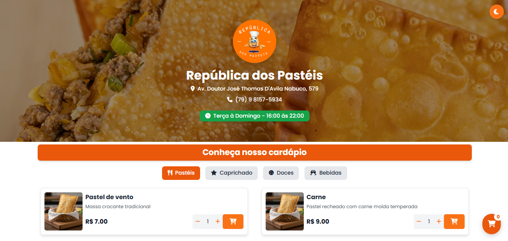
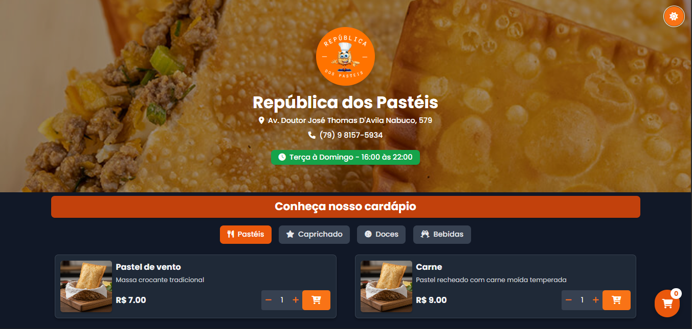
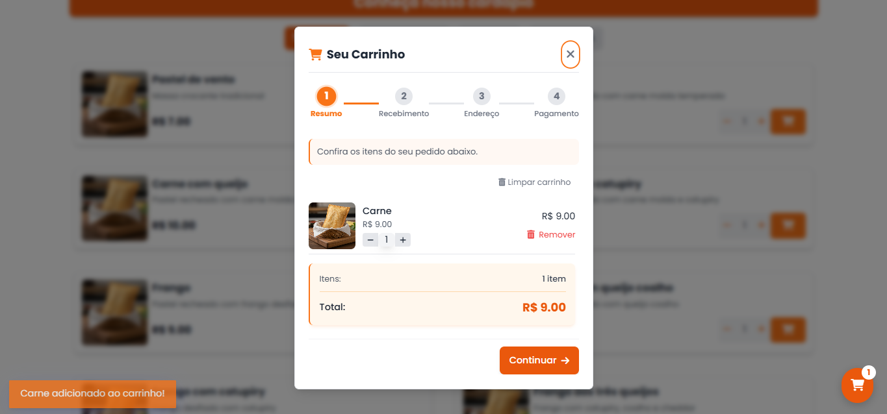
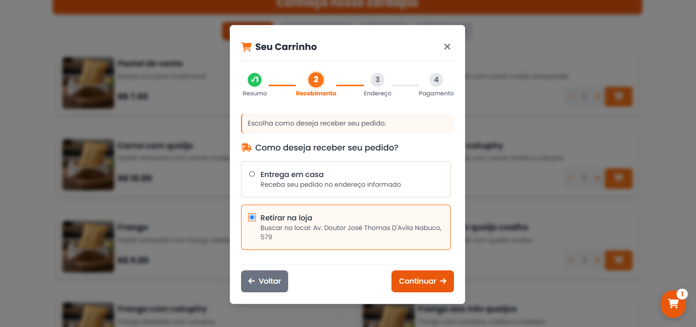
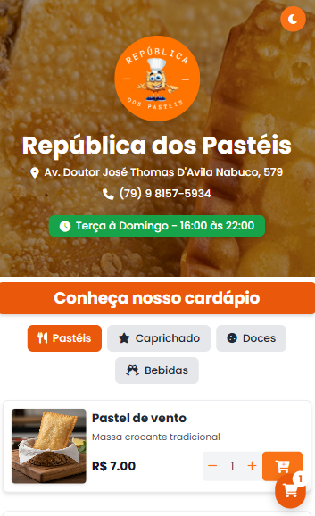
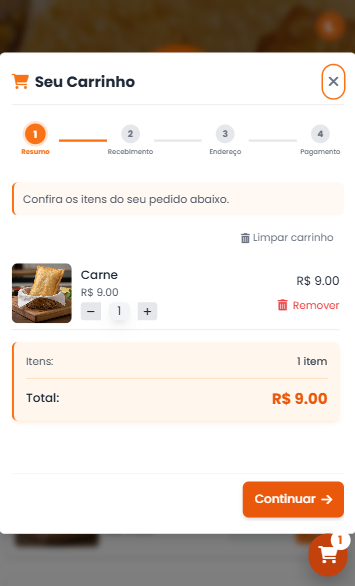

# República dos Pastéis — Cardápio digital

<!-- Badges (substitua os links / imagens pelos seus quando disponíveis) -->
[](./LICENSE) [](#) [](#) [](https://republica-dos-pasteis.vercel.app/)  

🔗 Deploy: https://republica-dos-pasteis.vercel.app/  

Bem-vindo(a)! Este repositório contém o site da "República dos Pastéis" com a implementação do sistema de carrinho de compras, estilos e scripts auxiliares.

## Sobre o projeto

O projeto é um site front-end para um estabelecimento de alimentação (pastelaria). Contém páginas, componentes e um sistema de carrinho para adicionar produtos, calcular totais e seguir o fluxo de checkout (resumo → método de recebimento → endereço → pagamento).

Este README descreve as funcionalidades principais, como executar localmente e onde estão os arquivos mais relevantes.

## Tecnologias

- HTML
- CSS (inclui arquivos gerados por Tailwind)
- JavaScript (vanilla)
- Tailwind CSS (configuração: `tailwind.config.js`)
- Git & GitHub
- Figma (opcional, para visualizar o layout)

## Recursos principais

- Sistema de carrinho completo (adicionar, atualizar quantidade, remover)
- Persistência local do carrinho (`localStorage`) com fallback
- Estilos responsivos e suporte a tema claro/escuro
- Scripts de recuperação/backup para garantir disponibilidade em falhas

## Estrutura do projeto (resumo)

- `index.html` — página principal
- `script.js` — script principail do site
- `cart-system.js` — lógica principal do carrinho
- `cart-backup.js`, `cart-fix.js`, `cart-system.js` — utilitários relacionados ao carrinho
- `styles/` — arquivos CSS (ex.: `style.css`, `cart.css`, `output.css`)
- `assets/` — imagens e recursos estáticos
- `legacy/` — código legado / versões antigas
- `tailwind.config.js` — configuração do Tailwind

> Observação: essa estrutura foi resumida; examine os arquivos no diretório para detalhes específicos.

## Como executar localmente

Opções simples para visualizar o site:

- Abrir `index.html` diretamente no navegador (duplo clique).
- Usar uma pequena servidor estático (recomendado para evitar problemas com requisições locais):

PowerShell (Python 3 instalado):

```powershell
python -m http.server 8000

# então abra http://localhost:8000 no navegador
```

Ou use a extensão Live Server do VS Code para servir a pasta do projeto.

## Funcionamento básico do carrinho (resumo)

- Adição: clicar em "Adicionar" atualiza o estado local e persiste no `localStorage`.
- Atualização: é possível alterar quantidade; o total é recalculado.
- Remoção: remover item atualiza subtotal e armazenamento.
- Cálculo: subtotal → aplicar descontos (se houver) → calcular impostos/frete → total.
- Sincronização: comportamento otimista no cliente; scripts validam e reconcilam com fontes de verdade (quando aplicável).

Arquivos chave:
- `cart-system.js` — implementa o estado e as operações do carrinho
- `cart-backup.js` — fallback para cenários de erro
- `styles/cart.css` — estilos do carrinho

## Comportamento do botão, horário de funcionamento e tema

O site implementa regras de negócio que afetam o comportamento do botão de pedido e o fluxo de checkout:

- Estado do botão (aberto / fechado): o botão de pedido muda de cor para indicar se a loja está aberta ou fechada — por exemplo, verde quando aberta e cinza/vermelho quando fechada. Isso fornece feedback visual imediato ao usuário.
- Bloqueio de pedidos fora do horário: quando o estabelecimento está fechado, o sistema não aceita novos pedidos. O botão fica desabilitado e o usuário recebe uma mensagem clara explicando que o estabelecimento está fechado e informando o próximo horário de abertura.
- Configuração de horário: os horários de funcionamento e regras estão centralizados no script `scripts/business-hours.js` (verifique esse arquivo para ajustar o horário, feriados ou regras especiais).
- Tema claro / escuro: o site suporta tema claro e escuro. O modo pode ser alternado pelo usuário e o estado do tema é preservado (ex.: `localStorage`) — confira `theme.js` e `styles/` para os arquivos relacionados.

Implementação e UX recomendadas:

- Use cores contrastantes claras para o estado "aberto" (ex.: verde) e neutras/indicativas para "fechado" (ex.: cinza abafado + tooltip explicativo).
- Ao tentar submeter um pedido enquanto fechado, mostre um modal ou toast com a mensagem e um botão para salvar o carrinho para envio posterior.
- Ofereça uma indicação de "Próxima abertura" (por exemplo: "Abrimos às 10:00") quando a loja estiver fechada.


## Layout

O layout visual foi feito e customizado para este projeto. 

## Screenshots (Desktop)







## Screenshots (Mobile)




## Licença

- Licença: MIT — consulte o arquivo `LICENSE` para os termos.

## Como contribuir

1. Faça um fork deste repositório
2. Crie um branch com a sua feature (`git checkout -b feature/nome-da-feature`)
3. Faça commits pequenos e claros
4. Abra um pull request descrevendo as mudanças

## Contato / Créditos

- Autor: rochajrdev
- Repositório: Rep-blica-dos-Pasteis

---

